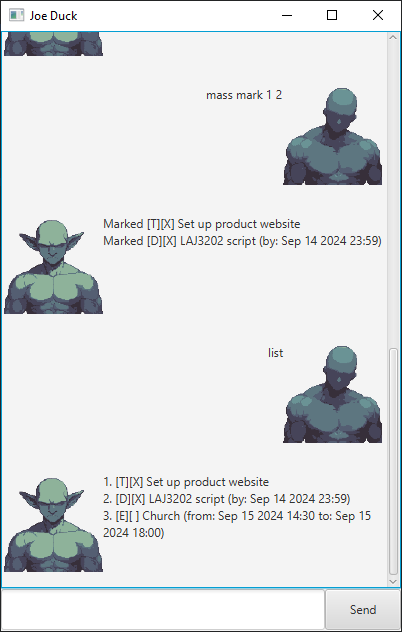

# Joe Duck User Guide



Your Joe Duckish companion for keeping track of things to do. The goblin's name is Joe Duck.

Saves/loads as commands are given to it. Save file location is `*user.home*/ip_data/tasks.txt`.

# Task Creation

---

## Todo

Add a Todo task with no associated time period.

### Usage

`todo [DESCRIPTION]`

### Example

`todo Set up product website`

### Result

```
Added Todo:
[T][ ] Set up product website
```

---

## Deadline

Add a Deadline task, associated with a single Date and Time.

### Usage

`deadline [DESCRIPTION] /by [YYYY-MM-DD HH:MM]`

### Example

`deadline Create LAJ3202 script /by 2024-09-14 23:59`

### Result

```
Added Deadline:
[D][ ] Create LAJ3202 script (by: Sep 14 2024 23:59)
```

---

## Event

Add an Event task, associated with a two Dates and Times, representing the start and end.

### Usage

`event [DESCRIPTION] /from [YYYY-MM-DD HH:MM] /to [YYYY-MM-DD HH:MM]`

### Example

`event Church /from 2024-09-15 14:30 /to 2024-09-15 18:00`

### Result

```
Added Event:
[E][ ] Church (from: Sep 15 2024 14:30 to: Sep 15 2024 18:00)
```

---

# Task Manipulation

---

## List

Lists all currently loaded tasks.

### Usage

`list`

### Result

```
1. [T][X] Set up product website
2. [D][X] LAJ3202 script (by: Sep 14 2024 23:59)
3. [E][ ] Church (from: Sep 15 2024 14:30 to: Sep 15 2024 18:00)
```

---

## Delete

Aliased to `remove`.

Deletes the task with specified index.

### Usage

`delete [TASK_INDEX]`

`remove [TASK_INDEX]`

### Example

`delete 1`

### Result

```
Removed [T][X] Set up product website
```

---

## Find

Gets all tasks that match a given pattern. Searches by the output given by `list`.

For power users: Inputted string is handled as a Regex pattern.

### Usage

`find [PATTERN]`

### Example

`find Sep`

### Result

```
2. [D][ ] Create LAJ3202 script (by: Sep 14 2024 23:59)
3. [E][ ] Church (from: Sep 15 2024 14:30 to: Sep 15 2024 18:00)
```

---

## Mark

Marks the task with the given index.

### Usage

`mark [TASK_INDEX]`

### Example

`mark 1`

### Result

```
Marked [T][X] Set up product website
```

---

## Unmark

Unmarks the task with the given index.

### Usage

`unmark [TASK_INDEX]`

### Example

`unmark 1`

### Result

```
Unmarked [T][ ] Set up product website
```

---

# Other Commands

---

## Bye

Exits the application.

### Usage

`bye`

---

## Mass

Batch operations on multiple tasks in a single command.

Supported commands: `mark` `unmark` `delete`

### Usage

`mass [COMMAND] ...`

### Example

`mass mark 1 2 3`

`mass remove 1 2 3`

### Result

```
Marked [T][X] Set up product website
Marked [D][X] Create LAJ3202 script (by: Sep 14 2024 23:59)
Marked [E][X] Church (from: Sep 15 2024 14:30 to: Sep 15 2024 18:00)
```

```
Removed [T][X] Set up product website
Removed [D][X] Create LAJ3202 script (by: Sep 14 2024 23:59)
Removed [E][X] Church (from: Sep 15 2024 14:30 to: Sep 15 2024 18:00)
```
